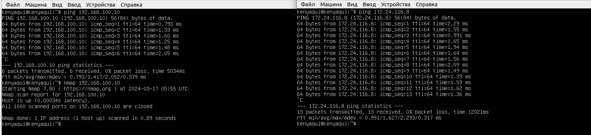
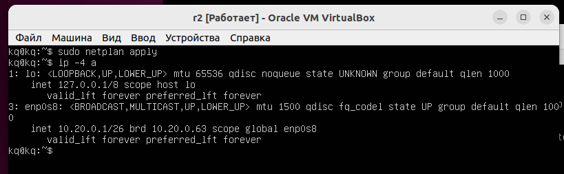

## s21_LinuxNetwork
Практическая работа по настройке сетей в Linux на виртуальных машинах

## Часть 1 Инструмент ipcal

### 1.1 Сети и маски

    1. Адрес сети для 192.167.38.45.13-192.160.0.0/13

    2. Маска подсети 255.255.255.0
       Маска подсети 255.255.255.0 в двоичной записи 11111111.11111111.11111111.00000000
       Префикс /15 в обычной записи 255.254.0.0
       Префикс /15 в двоичной записи 11111111.11111110.00000000.00000000
       Маска подсети 11111111.11111111.11111111.11110000 в обычной записи 255.255.255.240
       Маска подсети 11111111.11111111.11111111.11110000 в префиксной записи /28
    3. Минимальный и максимальный хост в сети 12.167.38.4 при масках:
    /8 - 12.0.0.1 и 12.255.255.254
    11111111.11111111.00000000.00000000 - 12.167.0.1 и 12.167.255.254
    255.255.254.0 - 12.167.38.1 и 12.167.39.254/4
    /4 - 0.0.0.1 и 15.255.255.254
### 1.2 Локальный хост
Можно ли обратиться к приложению, работающему на локальном хосте, соблюдая IP:
194.34.23.100 - нельзя
127.0.0.2 - можно, петля
127.1.0.1 - можно, петля
128.0.0.1 - нельзя

### 1.3 Диапазоны и сегменты сетей
    
    1. В качестве публичных можно использовать:
        134.43.0.2
        192.172.0.1
        172.68.0.2
        192.169.168.1

       В качестве канала можно использовать:
        10.0.0.45
        192.168.4.2
        172.20.250.4
        172.0.2.1
        172.16.255.255
        10.10.10.10
    2. В сети 10.100.0.0/18 может быть следующий адрес:
        10.10.0.2
        10.10.10.10
        10.10.1.255
## Часть 2. Статическая маршрутизация между двумя машинами
### Смотрим внешние интерфейсы
Используя ip a

Задаем следующие адреса и маски: ws1 - 192.168.100.10/16, ws2 - 172.24.116.8/12

### 2.1 Добавление статического маршрута вручную
Добавление статически маршрутов и пинг

### 2.2 Добавление статического маршрута с сохранением
Измененые файлы /etc/netplan/00-installer-config.yaml

Пингуем еще раз

## Часть 3. Утилита ipref3
### Скорость соединения
    8 Мбит/с = 1 МБ/с
    100 МБ/с = 819200 Кбит/с
    1 Гбит/с = 1024 Мбит/с

Скорость соединения между ws1 и ws2

## Часть 4. Сетевой экран
### 4.1 Утилита iptables

Правила в /etc/firewall.sh

Запуск файлов на обeих машинах

Если сначала стоит запрещающее правило, то оно имеет приоритет перед соблюдением разрешающего.

### 4.2 Утилита nmap

Ping+nmap

## Часть 5. Статическая маршрутизация сети

### Скрины с изменением файла /etc/netplan/00-installer-config.yaml для каждой машины

ws11

ws21

ws22

r1

r2

Если ошибок нет, то команда ip -4 проверит, что адрес машины задан верно.

ws11, ws22, r1,ws21

r2

Пропинговали ws22 с ws21. Аналогично пропинговали r1 с ws11

### 5.2 Включение переадресации IP - адресов

Вызов команды sudo sysctl -w net.ipv4.ip_forward=1 для машин r1 и r2. При таком подходе переадресация не будет работать после перезагрузки системы.

Открываем файл /etc/systcl.comf и добавляем в него net.ipv4.ip_forward=1. При его использовании этого соединения IP - переадресация включается на постоянной основе.

### 5.3 Установка маршрута по-умолчанию

Настраивамый маршрут по умолчанию (шлюз) для рабочих процессов в файле конфигураций etc/netplan/00-installer-config.ylaml

Пингуем r2 с ws11 и проверяем, что пинг проходит командой tcpdump -th -i eth1

### Добавление статических маршрутов
Доавляем в маршрутизаторы r1 и r2 статические маршруты в файлы конфигурации

Вызываем что бы увидеть таблицу с маршрутами на нижних маршрутизаторах

Запускаем на ws11 список ip r 10.10.0.0/[маска сети] и список ip r 0.0.0.0/0

Для адреса 10.10.0.0/[порт сети] был выбран маршрут отличный от 0.0.0.0/0, поскольку порт /18 опрелделяет маршрут к сети более точный, в отличии от порта /0

### 5.5 Постороение списка маршрутизаторов
Вывод команды трассировки от ws11 до ws21

Захват трафика на r1 с помощю tcmpdump -tnv -i eth0 при выполнении трассировки (команда трассировки) на ws11

Хост, с хорошей трассировкой, отправляет запросы по адресу с различными показателями "времени жизни" TTL, начиная с 1 и постепенно его увеличивая. Каждый хост на пути назначения отправляет пакет ICMP, время превышеного в пути, цикл что пакет еще не дошел до адреса назначения. Адресатора в данном пакете фиксируется при отслеживании, как промежуточное звено на пути отправителя к назначению адреса. По умолчанию запросы от хоста-источника отправляются с помощью "probe" - пакетов (зондов) по протоколу UDP, но с помощью ключей -I и -T можно заменить протокол на ICMP или TCP соответственно.

### 5.6 Использование протокола ICMP при маршрутизации
Вывод команды ping -c 1 10.30.0.111 на ws11 и tcmpdump -n -i eth0 icmp на r1

## Часть 6. Динамическая настройка IP с помощью DHCP
Для r2 настроим в /etc/dhcp/dhcpd.conf настройку службы DHCP
    1. Указываем адрес маршрутизатора по умолчанию, DNS-сервер и адрес внутренней сети
    
    2. В файле /etc/resolv.conf прописываем сервер имен 8.8.8.8
    
    3. Перезагружаем сервер DHCP командой systemctl isc-dhcp-server
    
    4. Машину 21 перезагружаем при помощи перезагрузки и через видно что она получила адрес
    
    5. Пингуем ws22 с ws21
    
    6. Указываем МАС-адрес ws11, для этого в /etc/netplan/00-installer-config.yaml добавляем строки macaddress:10:10:10:10:10:BA, dhcp4: true
    
    Настраивая r1 изменяю r2, но произвожу выдачу адресов с жесткой привязкой к МАС-адресу(11)
    
    
    
    Запрашиваем обновление ip адреса ws21
    

## Часть 7. NAT
Делаем сервер Apache2 общедоступным: в файле /etc/apache2/ports.conf на ws22 и r1 меняем строку Listen 80 на Listen 0.0.0.0:80
    
Запускаем веб-сервер Apache2 с командой apache2 start на ws22 и r1
    
Добавляем в /etc/firewall.sh на r2 следующие правила:
     1. удаление в правилах таблицы filter -iptables -F
     2. удаление в правилах таблицы NAT -iptables -F -t nat
     3. отбрасывать все маршрутизируемые пакеты -iptables -policy FORWARD DROP
     
    Проверяем соединение между ws22 и r1. При запуске файла ws22 не должен пинговаться с r1.
     
    Добавляем в файл еще одно правило:
     4. разрешить маршрутизацию всех пакетов протокола ICMP
    Запускаем файл
     
    Проверяем соединение между ws22 и r1.
     
    Добавляем еще два правила:
      5. Включаем SNAT, а именно маскирование всех локальных ip из локальной сети, на которые приходят за r2 (по обозначениям из Части 5 - сеть 10.20.0.0)
      6. включаем DNAT на порту 8080 r2 и добавляем к веб серверу Apache, активированному на машине ws22, доступ из внешней сети
    
    Запускаем файл
    Проверяем соединение по TCP для SNAT, для этого с ws22 подключаемся к серверу Apache на r1 команде telnet[адрес][порт]
    
    Проверяем соединение по TCP для DNAT, для этого с r1 подключаемся к серверу Apache на ws22 команда telnet [ [адрес r2][порт 8080]

## Часть 8. Знакомство с SSH-тунелями
Запускаем на r2 фйервол с првавами из части 7
Запусаем Apache на ws22 только на localhost (тоесть в  файле /etc/apache2/ports.conf меняем строку Listen 80 Listen на localhost:80)

Воспользуемся Local TCP forwarding с ws21 до ws22, что бы получить доступ к веб-серверу на ws22 с ws21

воспользуемся Remote TCP forwarding с ws11 до ws22, что бы получить доступ к веб-серверу на ws21 с ws11

Для проверки сработало ли подключение в обоих предидущих пунктах, выполняем telnet 127.0.0.1 [локальный порт]
